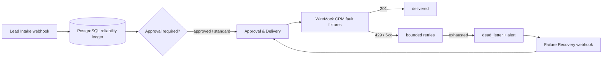
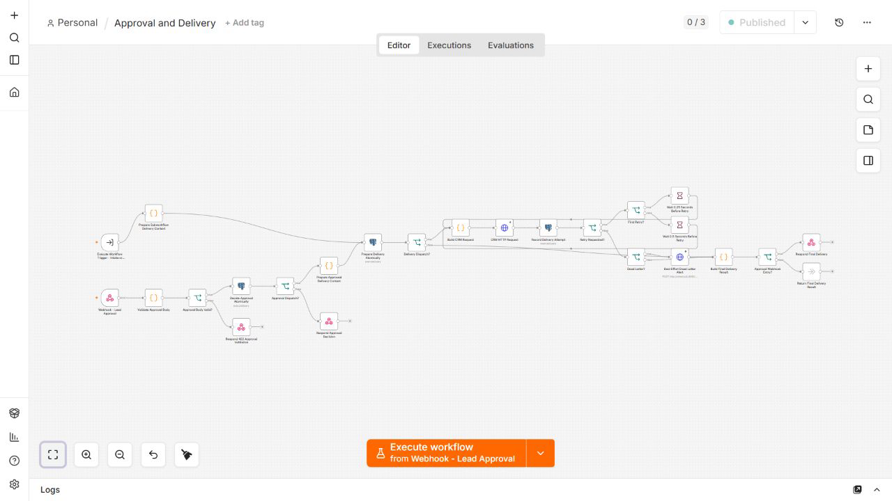
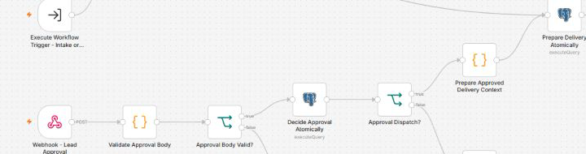
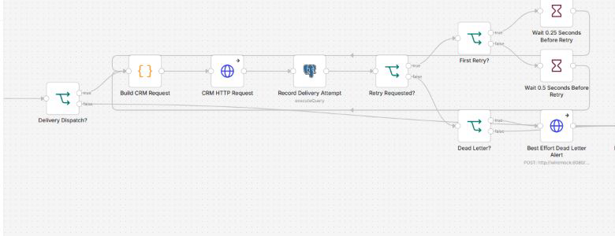

# n8n Reliability Lab

A production-oriented n8n workflow lab demonstrating webhook validation, idempotency, retries, human approval, PostgreSQL persistence, failure recovery, and automated acceptance tests.

Most workflow demos only show the happy path. This repository demonstrates what happens when payloads are invalid, events are duplicated, APIs fail, approval is required, or processing must be safely replayed.



<details>
<summary>View the complete Approval and Delivery workflow</summary>



</details>

Quick start:

```bash
docker compose up -d --wait
npm ci
npm test
```

Example acceptance output:

```text
PASS valid lead delivered
PASS duplicate event ignored
PASS invalid payload rejected
PASS transient failure recovered
PASS permanent failure moved to dead letter
PASS approval required before delivery
```

## Workflow evidence

These close-ups come from the running local n8n instance, not a recreated diagram.

### Human approval gate



### Bounded retry and dead-letter path



## The problem

Webhook delivery is easy to demonstrate and difficult to make trustworthy. A retry can duplicate a remote side effect, an approval can race with another approval, and a transient failure can leave an event in an unclear state. This repository provides a small, local system in which those failure modes are deterministic, testable, and recorded.

## Reliability guarantees

- PostgreSQL is the source of truth for event state, approvals, delivery attempts, and recovery claims.
- An inbound `event_id` is atomically claimed and every CRM attempt uses it as `Idempotency-Key`.
- Only 429 and 5xx responses retry, with at most three attempts per processing cycle.
- A non-retryable 4xx or exhausted retry becomes one open dead-letter record and one best-effort alert.
- Approval and recovery are protected by an imported HTTP Header Auth credential; workflow JSON contains no header value.
- Recovery claims a dead letter atomically before it can trigger another delivery cycle.

The result is effectively-once delivery around a PostgreSQL-to-HTTP boundary. It is not a claim of mathematical exactly-once delivery across two independent systems.

## Boundaries

This is a local reliability lab, not a production deployment. It intentionally has no TLS, reverse proxy, Redis, external CRM, or observability stack. WireMock supplies deterministic CRM responses only. All published Docker ports bind to `127.0.0.1` by default, so the demo is not exposed to the surrounding LAN. Local demonstration configuration is in `.env.example`; replace it before use outside a disposable local environment.

## Project structure

```text
bootstrap/                 n8n owner and credential import
database/migrations/       PostgreSQL ledger and operation functions
wiremock/mappings/         deterministic CRM and alert fixtures
workflows/                 intake, approval/delivery, and recovery workflows
tests/                     platform, database, intake, approval, delivery, recovery, artifacts
```

## Operations API

All endpoints are local n8n production webhook paths.

| Operation | Request |
| --- | --- |
| Intake | `POST /webhook/lead-intake` with an event envelope |
| Approval | `POST /webhook/lead-approval` with `event_id`, `decision`, `decided_by`, optional `reason`, and the configured operator header |
| Recovery | `POST /webhook/recovery-replay` with `event_id` and the configured operator header |

Approval accepts `approved` or `rejected`. Recovery only claims an open dead letter and is a no-op for an already recovered or otherwise ineligible event. See the fixture JSON and tests for complete request examples.

## Local fixture routes

The source field selects deterministic local CRM behavior: ordinary sources return 201, `wiremock-transient` returns 500 then 429 then 201, `wiremock-permanent` always returns 503, `wiremock-nonretryable` returns 400, and `wiremock-recoverable` returns three 503 responses before succeeding. These routes are a test protocol, not production routing logic.

## Documentation

- [Architecture](docs/architecture.md)
- [Acceptance tests](docs/acceptance-tests.md)
