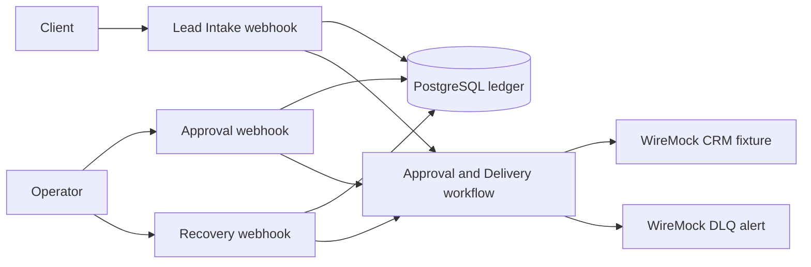
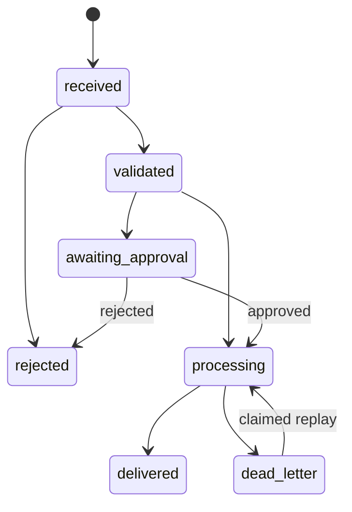

# Reliability Lab Architecture

This repository is a small, runnable reliability exercise for n8n: it accepts leads, persists their state before side effects, supports human approval, records bounded delivery attempts, and safely replays dead letters.

## Workflows and data flow

`Lead Intake - Validate and Claim` validates and normalizes the incoming payload, atomically claims `event_id`, writes the intake audit record, and routes a standard lead to delivery or a high-value/high-risk lead to approval.

`Approval and Delivery` has two entry points: an Execute Workflow Trigger for standard, approved, and replayed events, plus the protected approval webhook. It uses the ledger to decide approval, claim delivery work, record every HTTP attempt, and produce the final delivery state. It never implements a separate in-memory retry counter.

`Failure Recovery` exposes the protected replay webhook. It validates `event_id`, atomically claims an open dead letter, invokes the shared delivery workflow, and returns either the resulting state, a no-op, or a not-found response.

## State machine

PostgreSQL triggers enforce the allowed transitions, write terminal timestamps, update `updated_at`, and increment the optimistic version. `delivered` and `rejected` are terminal.

## Ledger

The five business tables are the source of truth:

- `inbound_events`: raw input, normalized lead fields, state, classification, approval requirement, cycle, and version.
- `workflow_runs`: one audit record per workflow execution and run type.
- `delivery_attempts`: explicit HTTP outcomes, retryability, request payload, and bounded response/error excerpts.
- `approval_requests`: one pending or decided approval per event.
- `dead_letter_events`: the current dead-letter record, failure detail, and replay count.

The ledger exposes atomic boundaries instead of asking workflows to reconstruct concurrency rules: `claim_inbound_event`, `finalize_intake`, `decide_approval`, `prepare_delivery`, `record_delivery_attempt`, and `claim_dead_letter_replay`. These functions use row locks, conditional updates, unique constraints, and transactional workflow audit updates.

## Credentials and trust boundary

Workflow exports contain credential IDs and names only. PostgreSQL access uses `LabPgCred0000001`; operator endpoints use `LabOpsCred000001` (`httpHeaderAuth`). Credential values are rendered from environment variables during bootstrap and are never embedded in workflow JSON. The n8n and ledger database roles are separate, non-superuser roles.

## Delivery guarantee and crash window

The system provides **effectively-once** delivery: a durable event ID becomes the CRM `Idempotency-Key`, attempts are persisted, and a successful event has at most one successful attempt row. It does not claim mathematical exactly-once across PostgreSQL and an external HTTP service. A process can still crash after the CRM accepts a request but before the attempt is recorded. Repeating the same idempotency key lets an idempotency-aware CRM collapse that replay.

## Local scope and production extensions

This is intentionally a single-instance lab. PostgreSQL owns coordination; WireMock is a deterministic local fault injector, not a production CRM or alerting system. Production evolution should add managed PostgreSQL backups and HA, real secret management, least-privilege network policies, observability/alerting, durable operator identity, CRM idempotency retention, exponential backoff with jitter, and operational dashboards for DLQ age and replay ownership.
